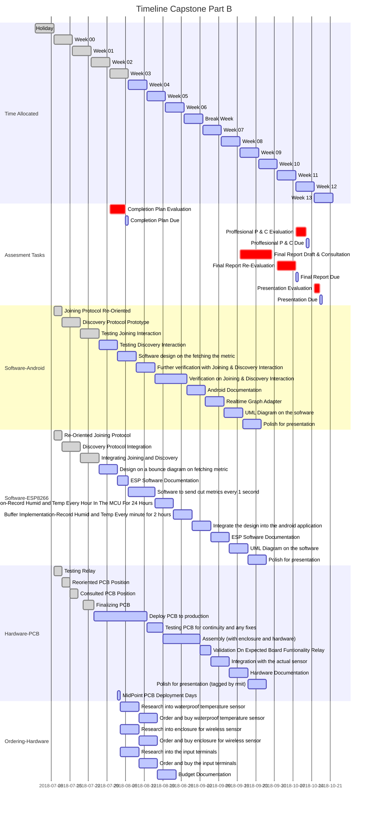

```mermaid
gantt
        dateFormat  YYYY-MM-DD
        
        title Timeline Capstone Part B 
        
        section Time Allocated
        Holiday                     :done, weekNull, 2018-07-02, 7d
        Week 00                     :done, week0, 2018-07-09, 7d
        Week 01                     :done, week1, 2018-07-16, 7d
        Week 02                     :done, week2, 2018-07-23, 7d
        Week 03                     :done, week3, 2018-07-30, 7d
        Week 04                     :active, week4, 2018-08-06, 7d
        Week 05                     :active, week5, 2018-08-13, 7d
        Week 06                     :active, week6, 2018-08-20, 7d
        Break Week                  :active, weekBreak, 2018-08-27, 7d
        Week 07                     :active, week8, 2018-09-03, 7d
        Week 08                     :active, week9, 2018-09-10, 7d
        Week 09                     :active, week10, 2018-09-17, 7d
        Week 10                     :active, week11, 2018-09-24, 7d
        Week 11                     :active, week12, 2018-10-01, 7d
        Week 12                     :active, week13, 2018-10-08, 7d
        Week 13                     :active, week14, 2018-10-15, 7d
    
        section Assesment Tasks
        Completion Plan Evaluation        :crit, after week2, 6d 
        Completion Plan Due :active, CompleteDue, 2018-08-05, 1d
        Proffesional P & C Evaluation :crit, after week12, 4d
        Proffesional P & C Due :active, ProfeshDue, 2018-10-12, 1d
        Final Report Draft & Consultation :crit , after week9, 12d
        Final Report Re-Evaluation :crit, after week11, 7d
        Final Report Due :active, FinalDue, 2018-10-08,1d
        Presentation Evaluation :crit, after week13, 2d
        Presentation Due :active, PresentDue, 2018-10-17, 1d

        section Software-Android
        Joining Protocol Re-Oriented :done, after weekNull, 3d
        Discovery Protocol Prototype :done, 7d
        Testing Joining Interaction :done , 7d
        Testing Discovery Interaction :active, 7d
        Software design on the fetching the metric :active, 7d
        Further verification with Joining & Discovery Interaction :active , 7d
        Verification on Joining & Discovery Interaction :active, 12d
        Android Documentation :active, 7d
        Realtime Graph Adapter: active, 7d
        UML Diagram on the sofrware :active, 7d
        Polish for presentation :active, 7d

        section Software-ESP8266
        Re-Oriented Joining Protocol :done, after weekNull, 3d
        Discovery Protocol Integration :done, 7d
        Integrating Joining and Discovery :done, 7d
        Design on a bounce diagram on fetching metric :active, 7d
        ESP Software Documentation :active, 4d
        Software to send out metrics every 1 second :active, 10d
        Buffer Implementation-Record Humid and Temp Every Hour In The MCU For 24 Hours :active, 7d
        Buffer Implementation-Record Humid and Temp Every minute for 2 hours :active , 7d
        Integrate the design into the android application :active, 7d
        ESP Software Documentation :active, 7d
        UML Diagram on the software :active, 7d
        Polish for presentation :active, 7d

        section Hardware-PCB
        Testing Relay :done, after weekNull, 3d
        Reoriented PCB Position :done, 3d
        Consulted PCB Position :done, 3d
        Finalizing PCB :done, PCBFinalized, 2018-07-20,4d
        Deploy PCB to production :active, FinalizingPCB, 2018-07-24, 20d
        Testing PCB for continuity and any fixes :active, 6d
        Assembly (with enclosure and hardware) :active, 14d
        Validation On Expected Board Funtionality Relay :active , 4d
        Integration with the actual sensor :active, 7d
        Hardware Documentation :active, 7d
        Polish for presentation (tagged by rmit) :active, 7d
        MidPoint PCB Deployment Days :active, MidPoint, 2018-08-02, 1d
        
        section Ordering-Hardware
        Research into waterproof temperature sensor :active, after MidPoint, 7d
        Order and buy waterproof temperature sensor :active, 7d
        Research into enclosure for wireless sensor :active, after MidPoint, 7d
        Order and buy enclosure for wireless sensor :active,  7d
        Research into the input terminals :active, after MidPoint, 7d
        Order and buy the input terminals :active, 7d
        Budget Documentation :active, 7d
        
```